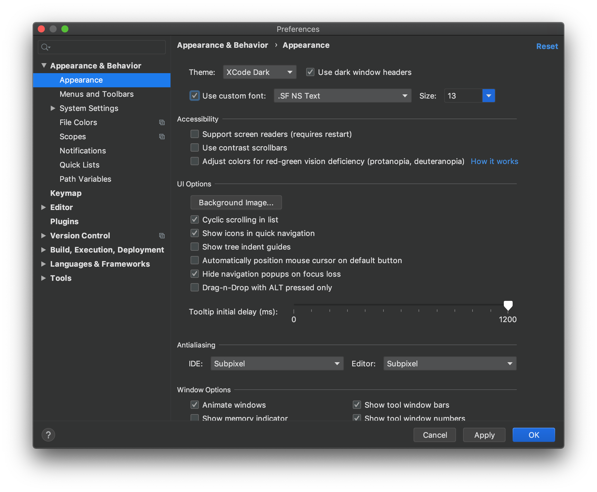
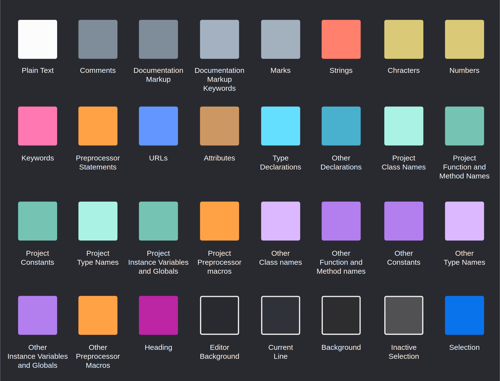

# IntelliJ XCode Dark Theme

This theme brings colors from the XCode Dark theme to IntelliJ IDE's.

Designed to work with the macOS dark theme, not tested on other operating systems.

## Screenshots

Recommended font: "SF Mono".

## XCode Dark palette

This theme is not an exact copy, but rather an artist's impression
of an editor theme with these colors.

Here are the colors from the XCode Dark palette:

## License

[MIT](LICENSE)
