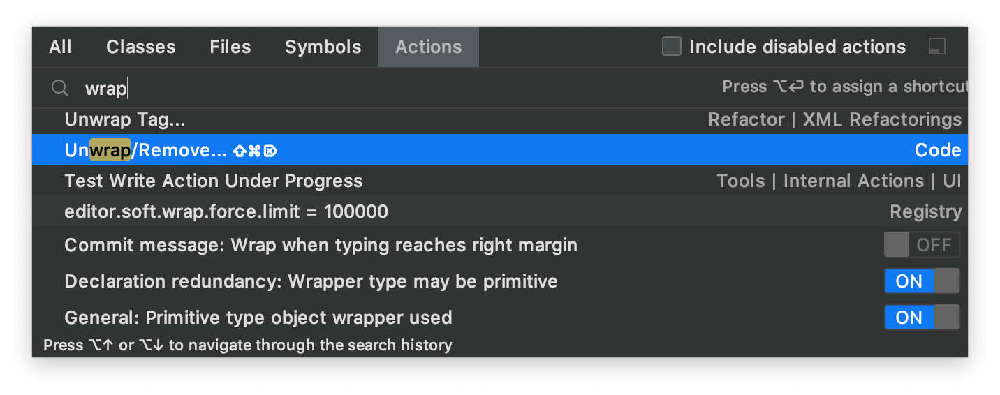

# IntelliJ Xcode Dark Theme

This theme brings colors from the Xcode Dark theme to IntelliJ IDE's.

Designed to work with the macOS dark theme, not tested on other operating systems.

## Installation

The plugin can be installed from the JetBrains marketplace:
https://plugins.jetbrains.com/plugin/13106-xcode-dark-theme/

## Feedback

Is there anything wrong 😱? Please [submit an issue](https://github.com/antelle/intellij-xcode-dark-theme/issues) here.  

Do you like ❤️ the project? I would be super happy if you leave a review on the
 [JetBrains marketplace](https://plugins.jetbrains.com/plugin/13106-xcode-dark-theme/).

## Screenshots

Code:

Settings:

Actions:

Recommended font: _SF Mono_
([how to install](https://medium.com/@shashikant.jagtap/getting-apples-sf-mono-font-in-macos-1de5183add84)).

## Xcode Dark palette

This theme is not an exact copy, but rather an artist's impression
of an editor theme with these colors.

Here are the colors from the Xcode Dark palette:

## License

[MIT](LICENSE)
